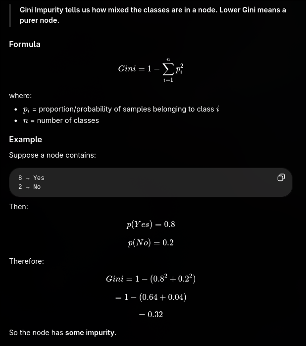
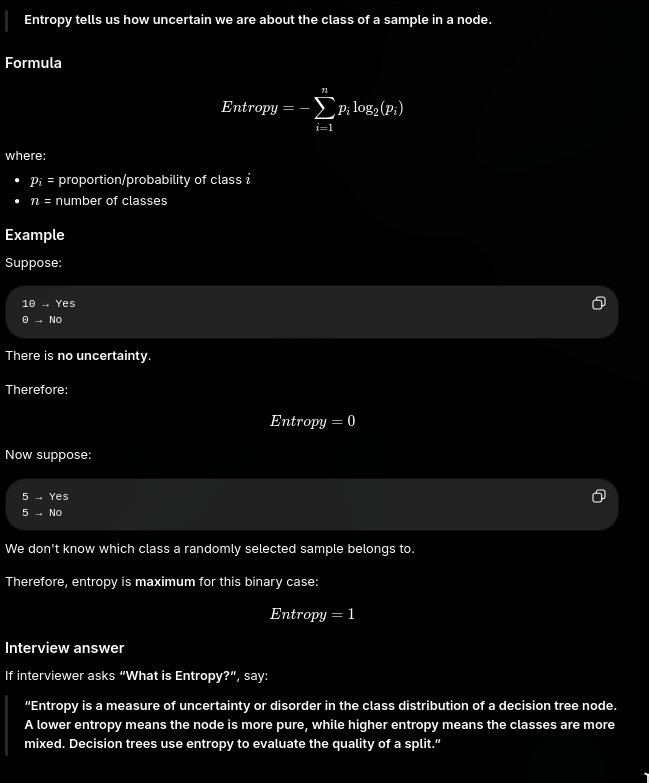

1. Impurity — Definition

Impurity is a measure of How many different classes are present together inside a node.

    Pure node: All samples belong to the same class → impurity is 0.
    Impure node: Samples belong to different classes → impurity is greater than 0.

Interview line:

    “Impurity tells us how mixed the classes are in a node, and decision trees try to create splits that reduce impurity.”

2. Gini Impurity 

Gini Impurity is a measure of the probability of incorrectly classifying a randomly selected sample if it is labeled according to the class distribution of its node.

In simpler words:

    Gini Impurity is a measure of how mixed the classes are in a node of a decision tree.

    More mixed → Higher Gini
    Less mixed → Lower Gini

2. Entropy 
    It measure of the uncertainty  or disorder in the class distribution of a node 

    “Entropy is a measure of uncertainty or disorder in the class distribution of a decision tree node. A lower entropy means the node is more pure, while higher entropy means the classes are more mixed. Decision trees use entropy to evaluate the quality of a split

| Gini Impurity                      | Entropy                                             |
| ---------------------------------- | --------------------------------------------------- |
| Measures **impurity/class mixing** | Measures **uncertainty/disorder**                   |
| Formula: (1-\sum p_i^2)            | Formula: (-\sum p_i\log_2p_i)                       |
| Lower value = better/purer         | Lower value = better/purer                          |
| 0 = completely pure                | 0 = completely pure                                 |
| Generally computationally faster   | Requires logarithmic calculation                    |
| Commonly used with **CART**        | Commonly associated with **Information Gain / ID3** |

# Complete Picture 
                        Decision Tree
                            |
                        Find a good split
                            |
                    ┌────────┴────────┐
                    ↓                 ↓
            Gini Impurity         Entropy
                    ↓                 ↓
            Measures mixing      Measures uncertainty
                    ↓                 ↓
                Lower = better     Lower = better
                    ↓                 ↓
                    └────────┬────────┘
                            ↓
                    Purer child nodes
            